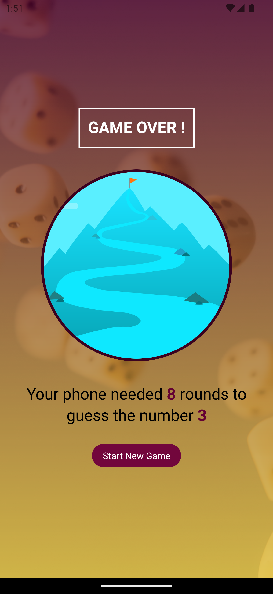

<!-- Project Shields -->

  
  
  
  

<!-- Project Logo -->
 

  

  <h3 align="center">Guess Number game in React-Native</h3>

  

    You tell a number to phone and phone has to guess the number and then you can see how many rounds it took for the phone to guess the number
     
    <a
      href="https://github.com/ujjwalgarg100204/guess-number-game-react-native/issues"
      aria-label="Link to issues of github repo"
      >Report Bug</a
    >
    ·
    <a
      href="https://github.com/ujjwalgarg100204/guess-number-game-react-native/issues"
      aria-label="Link to issues of github repo"
      >Request Feature</a
    >
  

<!-- TABLE OF CONTENTS -->

  
Table of Contents

  <ol>
    <li>
      <ul>
        <li><a href="#built-with">Built With</a></li>
      </ul>
    </li>
    <li><a href="#contributing">Contributing</a></li>
    <li><a href="#license">License</a></li>
    <li><a href="#links">Links</a></li>
    <li><a href="#author">Author</a></li>
  </ol>

#### Mobile Design

	 
	 
	 
	 
	 

(<a href="#readme-top">back to top</a>)

<!-- Built With -->

### Built With

<ul>
  <li>
    
  </li>
  <li>
    
  </li>
  <li>
    
  </li>  
</ul>

(<a href="#readme-top">back to top</a>)

<!-- CONTRIBUTING -->

## Contributing

Contributions are what make the open source community such an amazing place to learn, inspire, and create. Any contributions you make are **greatly appreciated**.

If you have a suggestion that would make this better, please fork the repo and create a pull request. You can also simply open an issue with the tag "enhancement".
Don't forget to give the project a star! Thanks again!

1. Fork the Project
2. Create your Feature Branch (`git checkout -b feature/AmazingFeature`)
3. Commit your Changes (`git commit -m 'Add some AmazingFeature'`)
4. Push to the Branch (`git push origin feature/AmazingFeature`)
5. Open a Pull Request

(<a href="#readme-top">back to top</a>)

<!-- LICENSE -->

## License

Distributed under the MIT License. See `LICENSE` for more information.

(<a href="#readme-top">back to top</a>)

## Links

-   Repo URL: [https://github.com/ujjwalgarg100204/guess-number-game-react-native](https://github.com/ujjwalgarg100204/guess-number-game-react-native)

<!-- AUTHOR -->

## Author

-   Website - [Ujjwal Garg](https://github.com/ujjwalgarg100204)
-   Instagram - [@ujjwalgarg100204](https://www.instagram.com/ujjwalgarg100204/)
-   Linkedin - [@ujjwalgarg100204](https://www.linkedin.com/in/ujjwal-garg-3a5639243/)
-   Twitter -[@UjwalGarg100204](https://twitter.com/UjwalGarg100204)

(<a href="#readme-top">back to top</a>)

